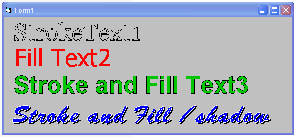



## Stroked Text  Usercontrol \(Updated\)

### Description

If you like hollow or outlined text then this is for you. Uses API for effects.Enjoy.

Update: Hopefully improved shadow blending.
 
### More Info
 

             |
---                |---
**Submitted On**   |2007-09-27 13:44:54
**By**             |[Kenneth Foster](https://github.com/Planet-Source-Code/PSCIndex/blob/master/ByAuthor/kenneth-foster.md)
**Level**          |Intermediate
**User Rating**    |5.0 (25 globes from 5 users)
**Compatibility**  |VB 6\.0
**Category**       |[Custom Controls/ Forms/  Menus](https://github.com/Planet-Source-Code/PSCIndex/blob/master/ByCategory/custom-controls-forms-menus__1-4.md)
**World**          |[Visual Basic](https://github.com/Planet-Source-Code/PSCIndex/blob/master/ByWorld/visual-basic.md)
**Archive File**   |[Stroked\_Te2084919272007\.zip](https://github.com/Planet-Source-Code/kenneth-foster-stroked-text-usercontrol-updated__1-69323/archive/master.zip)

